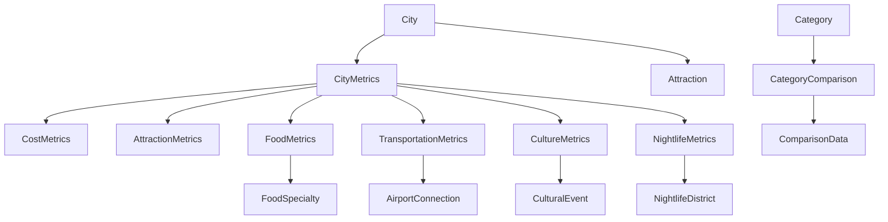

# Data Schema & Content Model
## Japan City Comparison App

### 🗂️ Overview
This document defines the data structure, content model, and schema for the Japan City Comparison App, ensuring consistent data handling across all components and features.

---

## 📊 Core Data Entities

### 1. City Entity
```typescript
interface City {
  id: string;                    // "tokyo", "osaka", "kyoto"
  name: string;                  // "Tokyo", "Osaka", "Kyoto"
  displayName: string;           // "Tokyo (東京)", "Osaka (大阪)", "Kyoto (京都)"
  description: string;           // Brief city overview
  heroImage: {
    url: string;                 // Hero banner image URL
    alt: string;                 // Accessibility description
    credit?: string;             // Photo credit/attribution
  };
  quickFacts: {
    population: number;          // City population
    prefecture: string;          // Prefecture name
    establishedYear: number;     // When city was established
    area: number;                // Area in km²
    averageTemp: {
      summer: number;            // Summer average °C
      winter: number;            // Winter average °C
    };
  };
  coordinates: {
    latitude: number;
    longitude: number;
  };
  metrics: CityMetrics;          // Category-specific data
  highlights: string[];          // Top 3-5 city highlights
  bestFor: string[];             // What this city is best for
  notIdealFor: string[];         // What this city might not be ideal for
  slug: string;                  // URL-friendly identifier
  colorTheme: string;            // Hex color for charts/UI
  lastUpdated: string;           // ISO date string
}
```

### 2. City Metrics Entity
```typescript
interface CityMetrics {
  cost: CostMetrics;
  attractions: AttractionMetrics;
  food: FoodMetrics;
  transportation: TransportationMetrics;
  culture: CultureMetrics;
  nightlife: NightlifeMetrics;
}

interface CostMetrics {
  overallIndex: number;          // 1-10 scale (10 = most expensive)
  accommodation: {
    budget: number;              // Average per night (¥)
    mid: number;
    luxury: number;
  };
  dailyBudget: {
    budget: number;              // Daily expenses (¥)
    mid: number;
    luxury: number;
  };
  meals: {
    streetFood: number;          // Average cost (¥)
    restaurant: number;
    fineDining: number;
  };
  transport: {
    dayPass: number;             // Public transport day pass (¥)
    taxiPerKm: number;
  };
}

interface AttractionMetrics {
  totalCount: number;            // Number of major attractions
  freeAttractions: number;       // Number of free attractions
  worldHeritageSites: number;    // UNESCO World Heritage sites
  museums: number;               // Number of major museums
  temples: number;               // Number of notable temples/shrines
  parks: number;                 // Number of major parks
  topAttractions: Attraction[];  // Featured attractions list
  uniqueExperiences: string[];   // City-specific unique experiences
}

interface Attraction {
  name: string;
  nameJP?: string;               // Japanese name
  description: string;
  category: 'temple' | 'museum' | 'park' | 'landmark' | 'district' | 'experience';
  estimatedTime: string;         // "2-3 hours", "Half day"
  cost: 'free' | 'low' | 'medium' | 'high';
  bestTimeToVisit: string;       // "Early morning", "Evening"
  accessibility: 'easy' | 'moderate' | 'challenging';
}

interface FoodMetrics {
  diversityScore: number;        // 1-10 scale
  michelinStars: number;         // Total Michelin stars in city
  streetFoodScore: number;       // 1-10 scale
  vegetarianFriendly: number;    // 1-10 scale
  specialties: FoodSpecialty[];  // Local food specialties
  marketCount: number;           // Number of major food markets
  restaurantDensity: number;     // Restaurants per 1000 people
}

interface FoodSpecialty {
  name: string;
  nameJP?: string;
  description: string;
  category: 'main' | 'snack' | 'dessert' | 'drink';
  difficulty: 'easy' | 'adventurous' | 'acquired_taste';
  whereToFind: string[];         // Notable places to try this food
}

interface TransportationMetrics {
  efficiency: number;            // 1-10 scale
  coverage: number;              // 1-10 scale
  easeOfUse: number;             // 1-10 scale for foreigners
  punctuality: number;           // 1-10 scale
  subwayLines: number;           // Number of subway/train lines
  busLines: number;              // Number of bus lines
  walkability: number;           // 1-10 scale
  bikeability: number;           // 1-10 scale
  airportConnections: AirportConnection[];
}

interface AirportConnection {
  airport: string;               // Airport name
  methods: string[];             // ["Express train", "Bus", "Taxi"]
  time: string;                  // "45 minutes"
  cost: number;                  // Cost in ¥
}

interface CultureMetrics {
  traditionalScore: number;      // 1-10 scale
  modernScore: number;           // 1-10 scale
  artScene: number;              // 1-10 scale
  festivalsCount: number;        // Major annual festivals
  culturalSites: number;         // Museums, galleries, cultural centers
  languageBarrier: number;       // 1-10 scale (10 = most English-friendly)
  localCustoms: string[];        // Important local customs/etiquette
  culturalEvents: CulturalEvent[];
}

interface CulturalEvent {
  name: string;
  nameJP?: string;
  description: string;
  season: 'spring' | 'summer' | 'autumn' | 'winter' | 'year-round';
  duration: string;              // "3 days", "1 week"
  significance: 'local' | 'national' | 'international';
}

interface NightlifeMetrics {
  vibrancy: number;              // 1-10 scale
  variety: number;               // 1-10 scale
  safety: number;                // 1-10 scale
  lastTrainTime: string;         // "24:00", "00:30"
  barCount: number;              // Approximate number of bars
  clubCount: number;             // Number of nightclubs
  izakayaCount: number;          // Traditional Japanese pubs
  uniqueVenues: string[];        // Unique nightlife experiences
  districts: NightlifeDistrict[];
}

interface NightlifeDistrict {
  name: string;
  nameJP?: string;
  description: string;
  vibe: 'traditional' | 'modern' | 'alternative' | 'upscale' | 'casual';
  bestFor: string[];             // ["Young professionals", "Tourists", "Locals"]
  priceRange: 'budget' | 'mid' | 'expensive';
}
```

### 3. Category Entity
```typescript
interface Category {
  id: string;                    // "cost", "attractions", "food", etc.
  name: string;                  // "Cost of Living"
  displayName: string;           // "Cost of Living"
  icon: string;                  // Lucide icon name
  description: string;           // Category explanation
  unit?: string;                 // "¥", "count", "score"
  chartType: 'bar' | 'radar' | 'pie' | 'line';
  colorScheme: {
    tokyo: string;               // Hex color
    osaka: string;
    kyoto: string;
  };
  comparisonKey: string;         // Key to extract from CityMetrics
  displayFormat: 'number' | 'currency' | 'percentage' | 'scale';
  tooltip: string;               // Helper text for users
  sortOrder: number;             // Display order
}
```

### 4. Comparison Data Entity
```typescript
interface ComparisonData {
  categories: CategoryComparison[];
  lastUpdated: string;           // ISO date string
  dataSource: string;            // "Internal Research", "Government Data"
  methodology: string;           // Brief explanation of data collection
}

interface CategoryComparison {
  categoryId: string;
  values: {
    tokyo: number;
    osaka: number;
    kyoto: number;
  };
  labels: {
    tokyo: string;               // Display label
    osaka: string;
    kyoto: string;
  };
  insights: string[];            // Key insights about this comparison
  winner: 'tokyo' | 'osaka' | 'kyoto' | 'tie';
  reasoning: string;             // Why this city "wins" this category
}
```

---

## 📁 Content Model Structure

### File Organization
```
/data
├── cities/
│   ├── tokyo.json
│   ├── osaka.json
│   └── kyoto.json
├── categories/
│   └── categories.json
├── comparisons/
│   └── comparison-data.json
└── content/
    ├── homepage.json
    ├── about.json
    └── metadata.json
```

### Sample Data Files

#### `/data/cities/tokyo.json`
```json
{
  "id": "tokyo",
  "name": "Tokyo",
  "displayName": "Tokyo (東京)",
  "description": "Japan's bustling capital city, where ultra-modern skyscrapers meet traditional temples and world-class cuisine.",
  "heroImage": {
    "url": "/images/tokyo-hero.jpg",
    "alt": "Tokyo skyline at sunset with Mount Fuji in the background",
    "credit": "Photo by Unsplash"
  },
  "quickFacts": {
    "population": 13960000,
    "prefecture": "Tokyo",
    "establishedYear": 1603,
    "area": 2194,
    "averageTemp": {
      "summer": 26,
      "winter": 6
    }
  },
  "coordinates": {
    "latitude": 35.6762,
    "longitude": 139.6503
  },
  "highlights": [
    "World's largest metropolitan area",
    "Cutting-edge technology and innovation",
    "Incredible food scene with most Michelin stars",
    "Perfect blend of traditional and modern culture",
    "Efficient public transportation system"
  ],
  "bestFor": [
    "First-time visitors to Japan",
    "Business travelers",
    "Food enthusiasts",
    "Shopping lovers",
    "Tech and innovation seekers"
  ],
  "notIdealFor": [
    "Budget travelers",
    "Those seeking quiet, traditional experiences",
    "Visitors avoiding crowds"
  ],
  "slug": "tokyo",
  "colorTheme": "#f94144",
  "lastUpdated": "2025-01-15T00:00:00Z"
}
```

#### `/data/categories/categories.json`
```json
[
  {
    "id": "cost",
    "name": "Cost of Living",
    "displayName": "Cost",
    "icon": "DollarSign",
    "description": "Overall expense level for accommodation, food, and activities",
    "unit": "scale",
    "chartType": "bar",
    "colorScheme": {
      "tokyo": "#f94144",
      "osaka": "#f3722c",
      "kyoto": "#577590"
    },
    "comparisonKey": "cost.overallIndex",
    "displayFormat": "scale",
    "tooltip": "1 = Very affordable, 10 = Very expensive",
    "sortOrder": 1
  },
  {
    "id": "attractions",
    "name": "Attractions",
    "displayName": "Attractions",
    "icon": "Camera",
    "description": "Number and quality of tourist attractions and experiences",
    "unit": "count",
    "chartType": "bar",
    "colorScheme": {
      "tokyo": "#f94144",
      "osaka": "#f3722c",
      "kyoto": "#577590"
    },
    "comparisonKey": "attractions.totalCount",
    "displayFormat": "number",
    "tooltip": "Major tourist attractions and experiences",
    "sortOrder": 2
  }
]
```

#### `/data/comparisons/comparison-data.json`
```json
{
  "categories": [
    {
      "categoryId": "cost",
      "values": {
        "tokyo": 8.5,
        "osaka": 6.8,
        "kyoto": 7.2
      },
      "labels": {
        "tokyo": "Very Expensive",
        "osaka": "Moderate",
        "kyoto": "Expensive"
      },
      "insights": [
        "Tokyo is 25% more expensive than Osaka",
        "Accommodation costs are highest in Tokyo",
        "Kyoto falls between Tokyo and Osaka for overall costs"
      ],
      "winner": "osaka",
      "reasoning": "Osaka offers the best value for money with lower accommodation and dining costs"
    }
  ],
  "lastUpdated": "2025-01-15T00:00:00Z",
  "dataSource": "Internal Research & Government Statistics",
  "methodology": "Data collected from official tourism boards, hotel booking sites, and local research"
}
```

---

## 🔄 Data Flow & Relationships

### Entity Relationships


### Data Validation Rules
1. **Numeric Scales**: All 1-10 scales must be validated within range
2. **Currency Values**: All yen amounts must be positive integers
3. **Date Formats**: All dates must be ISO 8601 format
4. **Required Fields**: Core fields (id, name, colorTheme) are mandatory
5. **Unique Identifiers**: City IDs must be unique and URL-safe
6. **Color Validation**: All hex colors must be valid 6-digit hex codes

### Content Update Workflow
1. **Data Sources**: Tourism boards, government statistics, local research
2. **Update Frequency**: Quarterly for costs, annually for attractions
3. **Validation Process**: Schema validation → content review → deployment
4. **Rollback Strategy**: Version control with ability to revert changes

---

## 🎯 Implementation Guidelines

### Frontend Data Consumption
```typescript
// Example React hook for city data
const useCityData = (cityId: string) => {
  const [city, setCity] = useState<City | null>(null);
  const [loading, setLoading] = useState(true);
  
  useEffect(() => {
    import(`../data/cities/${cityId}.json`)
      .then(data => setCity(data.default))
      .finally(() => setLoading(false));
  }, [cityId]);
  
  return { city, loading };
};

// Example comparison data hook
const useComparisonData = (categoryId: string) => {
  const [comparison, setComparison] = useState<CategoryComparison | null>(null);
  
  useEffect(() => {
    import('../data/comparisons/comparison-data.json')
      .then(data => {
        const category = data.default.categories.find(c => c.categoryId === categoryId);
        setComparison(category || null);
      });
  }, [categoryId]);
  
  return comparison;
};
```

### Chart Data Transformation
```typescript
// Transform city metrics for Recharts
const transformForChart = (comparison: CategoryComparison) => {
  return [
    { city: 'Tokyo', value: comparison.values.tokyo, fill: '#f94144' },
    { city: 'Osaka', value: comparison.values.osaka, fill: '#f3722c' },
    { city: 'Kyoto', value: comparison.values.kyoto, fill: '#577590' }
  ];
};
```

### Search & Filter Capabilities
```typescript
// Search interface for future features
interface SearchFilters {
  budget: 'low' | 'medium' | 'high';
  interests: ('culture' | 'food' | 'nightlife' | 'shopping')[];
  duration: 'short' | 'medium' | 'long';
  travelStyle: 'solo' | 'couple' | 'family' | 'group';
}
```

This comprehensive data schema provides a solid foundation for the Japan City Comparison App, ensuring consistent data handling, easy maintenance, and scalability for future features.